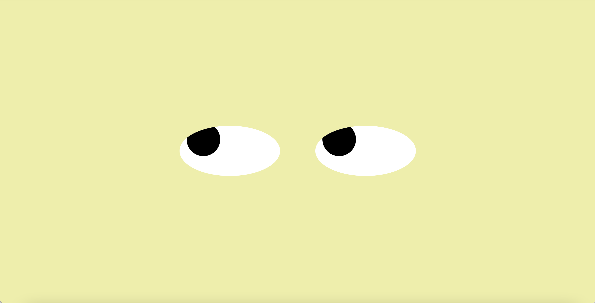

# Eye-Exercise
## This code creates two eyes that follow the position of your mouse. Background color will also change with the position of your mouse.

How to run:
Move the mouse around the screen and the eyer will follow.

